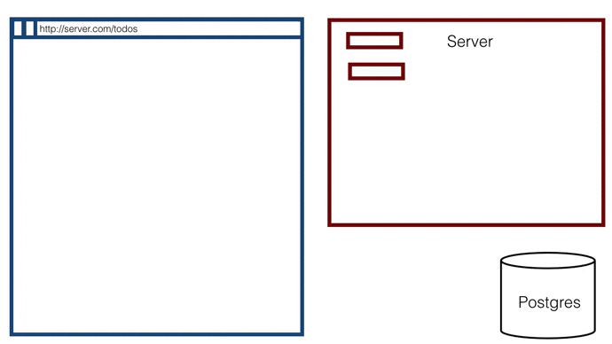

# can-connect-ndjson

[](https://greenkeeper.io/)

[](https://travis-ci.org/canjs/can-connect-ndjson)

[](https://saucelabs.com/beta/builds/04de5977a9784f0ebb38d9427166b387)

`Can-connect-ndjson` is a [`can-connect`]() behavior that enables `can-connect` to consume NDJSON stream services.

## Demo

All the demo code can be found in the `demo/` directory. 

1. To get started install dependencies and run the demo server.

```shell
$ cd demo/
$ npm install
$ node server.js
```

2. Navigate to localhost:8080/demo/can-connect-ndjson.html to see the demo in action.

3. Check out the demo code in `demo/can-connect-ndjson.html`.




## Contributing

### Making a Build

To make a build of the distributables into `dist/` in the cloned repository run

```
npm install
node build
```

### Running the tests

Tests can run in the browser by opening a webserver and visiting the `test.html` page.
Automated tests that run the tests from the command line in Chrome can be run with

```
npm test
```
